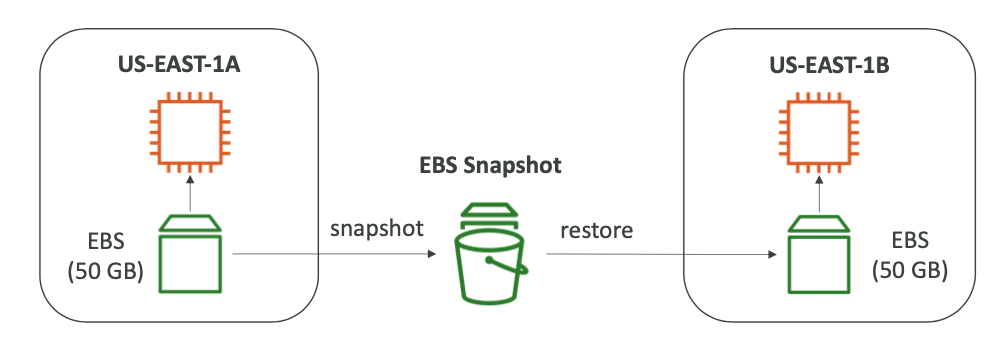
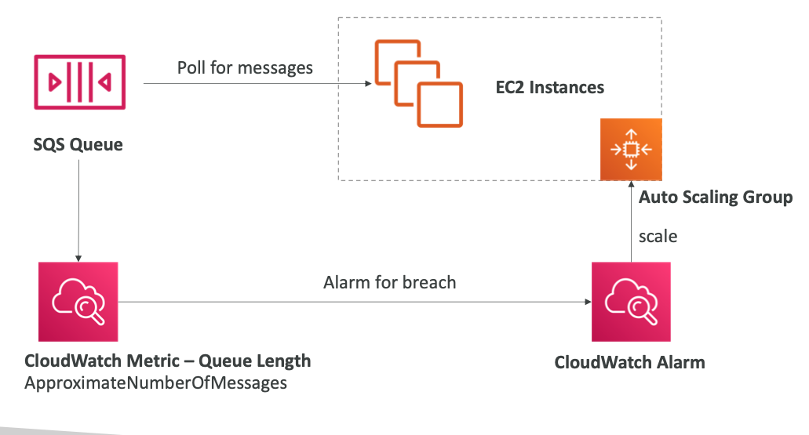

# AWS DEVELOPER

## AWS Console

### AWS has global Services
- Identity and Access Managments (IAM)
- Route53 (DNS Service)
- CloudFront (Content Delivery Network - CDN)
- WAF (Web Applications Firewall)

### Most AWS Services are Region-scoped
- Amazon EC2 (Infrastructure as a service)
- Elastic Beanstalk (Platform as a service)
- Lambda (Function as a Service)
- Rekognition (Software as a Service)

## IAM: Identity and Access Managments

IAM: Identity and Access Managments (Global)
Root account: Created by default
User: People within your organization, and can be grouped
Groups: Only contain users, other groups

Login: https://huallpa-nestor-aws.signin.aws.amazon.com/console


### Permissions

Policies: These are JSON Documents. Define the permissions of the users
Example: arn:aws:iam::aws:policy/IAMReadOnlyAccess

```JSON
{
    "Version": "2012-10-17",
    "Id": "General-report-permition",
    "Statement": [
        {
            "Effect": "Allow",
            "Action": [
                "iam:GenerateCredentialReport",
                "iam:GenerateServiceLastAccessedDetails",
                "iam:Get*",
                "iam:List*",
                "iam:SimulateCustomPolicy",
                "iam:SimulatePrincipalPolicy"
            ],
            "Resource": "*"
        }
    ]
}
```
You can create custom policies.

### IAM Policies

Consists of 
- Version: policy language version, always include “2012-10-17”
- Id: an identifier for the policy (optional) • Statement: one or more individual statements (required)
-  Statements consists of
   -  Sid: an identifier for the statement (optional) 
   -  Effect: whether the statement allows or denies access
(Allow, Deny)
- Principal: account/user/role to which this policy applied to 
- Action: list of actions this policy allows or denies 
- Resource: list of resources to which the actions applied to 
- Condition: conditions for when this policy is in effect
(optional)


### IAM Password Policy
- Strong password = higher security for your account
- In AWS, you can setup a password Policy
  - Minumum password length
  - including uppercase, lowercase letters, numbers, non-alphanumeric character.
- Allow all IAM Users to change their own passwords
- Require users to change their password after some time
- Prevent password re-user

### Multifactor authentication - MFA

Login = Password + MFA 

### AWS CLI command hands on 

```
aws configure
```

### IAM for services

We can assign roles to services using IAM Role
- EC2 Instance Role
- Lambda Function Role
- Role for CloudFormation

### Herramientas de seguridad

- IAM Credential Report (account-level)
- IAM Access Advisor (user-level)
    - It shows the service permissions granted to a user and when those services were last accessed.
    - You can use this information to revise your policies


### Best Practicies
- Don't use the root user account
- One to one physical user to AwsUser
- Assing users group and assign permitions to groups
- Create strong password policy
- Use of Multi Factor Authentication MFA
- Create a use Role for giving permitions to AWS Services
- Use access key for programatic access (CLI/SDK)
- Audit permition of your account with the IAM Credential report.
- Never share IAM users & access keys


## EC2: Elastic Computing Cloud
- Capabilities
    - Rent EC2
    - Storage EBS
    - Load balancing ELB
    - Autoscaling ASG
- Configuration options
    - Operating sistem
    - CPU y core
    - Random access memory
    - Storage space
    - Network card
    - Firewall rule
    - boostrap Script: EC2 Data Script (Bootraping)
        - Install software, updates, downloading commons file.
        - It needs permisition


``` bash
#!/bin/bash
yum update -y
yum install -y httpd
systemctl start httpd
systemctl enable httpd
echo "<h1>Hello World from $(hostname -f)</h1>" > /var/www/html/index.html
```

Note: Th private Ipv4 address doesn't change when a EC2 is stopped but public ip so does.

- EC2 Instance Type: https://aws.amazon.com/es/ec2/instance-types/
    - Structure: m5.2xlarge
        - m: instance class
        - 5: generation
        - 2xlarge: size within the instance class 
    - General Purpose
        - For Web servers or code repository
        - Balance between compute, memory, Networking
        - t2.micro
    - Compute Optimazed. Great for compute intensive task
        - Procesesing  Batch
        - Media Transcoding
        - High performance web server
        - High performance computing (HPC)
        - Game servers
        - Scientific modeling & ML
        - C6g, C6gn, C5, C5a, C5n, C4
    - Memory Optimazied: Process large data sets in memory 
        - High perfomance en Base de datos relacional y no relacional.
        - In-Memory base de datos para BI
        - Application Real time
        - R6g, R5, R5a, R5b, R5n, Ra, X1e, X1, high memory, z1d
    - Storage optimized.
        - High frecuency online transaction processing (OLTP)
        - Relational & NoSQL databases
        - Data wherehousing application
        - File sytem distribuido.
        - l3, l3en, D2, D3, D3en, H1
    - https://instances.vantage.sh/

- Security Groups
  - They control how traffic is allowed into or out of our EC2 instances
  - Security groups only contain *allow* rules
  - Security groups rules can reference by IP or by security group


- They regulate:
  - Access to Ports
  - Authorised IP ranges - IPv4 and IPv6
  - Control of inbound network
  - Control of outbound network


- **Good to know**
  - Can be attached to multiple instances
  - Locked down to a region /VPC combination
  - Does live "outside" the EC2 - if traffic is blocked the EC2 instances won't see it.
  - _It's good to maintain one separate secutiry group for SSH access_
  - If your application is not accessible (time out), then it's a security group issue
  - If your application gives a "connection refused" error, then it's an application error or it's not launched.
  - All inbound traffic is **blocked** by default
  - All outbound traffic is **authorised** by default

- Important port
  - 22 = SSH (Secure Shell) - Log into linux instance
  - 21 = FTP (file transfer protocol) - upload files into a file share
  - 22 = SFTP
  - 80 = HTTP
  - 443 = HTTPS
  - 3389 = RDP


- SSH
chmod 0400 EC2Test.pem
ssh -i EC2Test.pem ec2-user@44.204.172.204

#### EC2 Purchasing Options
- On demand: Short workload, predectible pricing
    - Pay per use
      - Linux or Windows - billing per second, after the first minute.
      - All other operating System - billing per hour
    - Has the highest cost but no upfront payment
    - No long-term commitment.
    - Recomended for short-term and un-interrupted workload, where you can't predict how the application will behave
- Reserved: (Minimun 1 year)
  - Up to 75% discount compared to On-demand
  - Reservations Period: 1 year = + discount | 3years = +++ discount
  - Purchasing options: no upfront | partial upfront = + | All upfront = +++
  - Reserve a specific instance type
  - Recomended for staedy-stage usage applications
  - Convertible Reserved Instance. 66% discount.
- **Saving Plans** 
  - Get a discount based on long-term usage (up to 72%)
  - Commit to a certain type of usage ($10/hour for 1 o 3 years)
  - Flexible across
    - Instance Size (m5.xlarge, m5.2xlarge)
    - OS (Linux, Windows)
    - Tenancy (Host, Dedicated, Default)
- **Spot Instances**: Short workload, cheap, can lose instance
  - Can get a discount of up to 90% compared to on-demand
  - Instances tha you can lose at any point of time if your max price is less than the current spot price
  - The most cost-efficient instances in AWS.
  - Useful for workloads thah are resilient to failure
    - Batch jobs
    - Data analysis
    - Image processing
    - Any distributed workloads
    - Workloads with a flexible start and end time
  - No suitable for critical job or databases
- **EC2 Dedicated Host**: Book an entire physical server.
  - Allocated for your account for a 3-yeas period reservation
  - The most expensive
- **EC2 Dedicated instances**
- EC2 Capacity Reservacion
  - Reserve **OnDemand** instances capacity in a separete AZ for any duration
  - You always have access to EC2 capacity when you need it
  - No commitment
  - _Suitable for short-term. uninterrupted workloads that needs to be in a specif AZ_
  
## 6 - EBS - Elastic Block Store
- It allows your instance to persist data, event after their termination
- They can only be mounted to one instance at a time (at the CCP level)
- They are bound to a specific availability zone
- EBS Volume
  - It is a network drive
    - There might be a bit of latency
  - It is locked to an Availability Zone (AZ)
    - An ESB volume in us-east-1a cannot be attached to us-east-1b
    - To move a volume across, you first need to snapshot it
  - Have a provisioned capacity (size in GB, and IOPS)
  


### EBS Snapshots
- Make a backup (snapshot) of your ESB volume at any point at time
- Not necessary to detach volumen to do snapshot, but recommended
- Can copy snapshots across AZ or Region
- **EBS Snapshot Archive**
  - Move a Snapshot to an "Archive tier" that is 75% cheaper
  - Takes within 24 to 72 hours for restoring the archive.
- **Recycle Bin for EBS Snapshots**
  - Setup rules to retain deleted snapshots so you can recover them after an accidental deletion
  - Specify retentions (from 1 day to 1 year)
- **EBS Snapshot Hang-on**


### AMI 
- AMI = Amazon Machine Image
- AMI are a customization of and EC2 instance
- AMI are built for a specific Region
- You can launch EC2 instance from
  - A Public AMI
  - Your own AMI
  - An AWS Marketplace AMI
- AMI Process
  - Start a EC2 instance and customize it
  - Stop the instances
  - Build an AMI
  - Launch instances from other AMIs
  


- **AMI Hang-on**


### EC2 Instance Store
- EBS volumes are networks drives with good but "limited" performance
- **If you need a high performance hardware disk, use EC2 instance store**
- Better I/O performance
- EC2 Instance Store lose their storage if they are stopped
- Good for buffer / Cache / scratch data / temporary content
- Risk of data loss if hardware fails
- Backups and Replications are your responsability

### EBS Volume Type
- **gp2 / gp3 (SD)**: General Purpose SSD Volume that balances price and performance for wide variaty of workloads.
  - Cost effective storage
  - System boot volumes,
  - gp3: New version
    - Can increase IOPS up to 16000 and throughput up to 1000 MiB/s _independently_
  - gp3: Olders
    - Size of volume and IOPS are _liked_
- **io1 / io2 (SD)**: Provisioned IOPS. Highest performance SSd volume for mission critical low-latency or high-throughput workloads.
  - Provisioned IOPS.
  - Critical business applications with sustained IOPS performance
  - Or applications that need more than 16000 IOPS
  - Great for databases workloads
  - Can increase PIOPS indenpendently
  - io1/io2 (4GiB - 16TiB)
    - Max PIOPS: 64000 for Nitro EC2 instances & 32000 for other.
  - io2 Block Express
  - Supports EBS Multi attach (only for io1/io2 family)
    - **Attach the same ESB volume to multiple EC2 instance in the same AZ**
- **st1 (HDD)**: Low cost HDD volume designed for frequently accessed, throughput-intensive workloads.
  - Cannot be a boot volume
  - Throughput Optimized HDD. St 1 (HDD)
- **Sc 1 (HDD)**: Lowcost HDD volume designed for less frecuently accessed workloads.
  - For data that is infrequently accessed.


> Only gp2/gp3 andio1/io2 can be used as boot volumes

https://docs.aws.amazon.com/AWSEC2/latest/UserGuide/ebs-volume-types.html

### EFS Elastic File System

- Managed NFS (network faile system) that can be mounted on may EC2
- EFS works with EC2 instances in multi-AZ
- Highly available, scalable, expensive (3x gp2), pay per use


- Use cases:  content managegment, web serving, data sharing, wordpress
- Uses NFSv1.1 protocol
- Uses security group to control access to EFS
- _Compatible with Linux based AMI_
- Encryption at rest using KMS
- POSIX file system that has a standard file API
- File system scale automatically, _pay per use_, no capacity planning.

### EFS Performance & Storage Classess
- EFS Scale
  - 1000s of concurrent NFS clients, 10 GB+ /s throughput
  - Grow to petabyte-scale network file system, automatically
- Performance mode
  - General Purpose: For webservising
  - Max I/O: For big data
- Troughput mode
  - Bursting
  - Provisioned
- Storage Tiers
  - Standard: For frequently accessed files.
  - Infrequent access (EFS-AI): cost to retrieve files, lower price to store. Enable EFS-IA with a lifecycle policy.
- Availability and Durability
  - Regional: Multi-AZ, great for PROD
  - One Zone: One AZ, great for dev, backup enabled.
- Over 90% in cost savings


---
## 7 - AWS Fundamentals : ELB + ASG

- Scaling
  - Vertical: Increase the size of the instance
  - Horizontal: Incresase or decrease number of instance
    - Auto scaling group
    - Load Balancer
- High Availability: Run instances for the same application across multi AZ
  - Auto Scaling Group Multi AZ
  - Load Balancer multil AZ

- **Elastic Load Balancer**
  - Is a managed load balancer
    - AWS guarantiees that it will be working
    - AWS takes care of upgrades, maintenance, high availability
    - AWS provides only a few configuration knobs
- **Clasic Load Balancer (CLB)**
  - Supports TCP, HTTP & HTTPS
  - Heath checks are TCP or HTTP based

- **Application Load Balancer (ALB)**
  - Applications load balancers is Layer 7 (http)
  - Load balancing to multiple http applications across machines (targets groups)
  - Load balancing to multiple applications on the same machine (ex: containers)
  - Support for Http/2 and WebSockets
  - Support refirect (from HTTP to HTTPS for example)
  - Routing tables to differents targets groups:
    - Routing based on path in URL
    - Routing based on hostname in URL
    - Routing based on Query String, Headers
  - ALB are a great fit for microservicies & container-based applications
  - Has a port mapping feature to redirect to a dynamic port in ECS
  - **Target Groups**:
    - EC2 Instances
    - ECS task
    - Lambda functions
    - IP Address
  - ALB can route to multiple target geoups
  - Health checks are at the target group level

- **Network Load Balancer (NLB)**
  - Forward TCP & UDP traffic to your instances
  - Handle millions of request per seconds
  - Less latency around 100 ms (vs 400 ms for ALB)
  - NBL has one static IP per AZ, and supports assigning Elastic IP
  - NLB are used for extreme performace, TCP or UDP traffic
  - Targets Groups
    - EC2 instances
    - IP Address - mus be private IP
    - Application Load Balancer

- **Gateway Load Balancer (GLB)**
  - Deploy, scale, and manage a fleet of 3rd party network virtual appliances in AWS. Example: Firewall, instrusion detection and Prevention Systems, Deep Packet Inspection System, payload manipulation.
  - Operates at Level 3
  - Combines the following functions
    - Trasparent Network Gateway
    - Load Balancer
  - Uses the GENEVE protocol on port 6081
  - Target Group
    - EC2 Instances
    - IP Address


- **Sticky Sessions**
  - The same client is always redirected to the same instances behind a load balancer
  - This works for Clasical Load Balancer & Application Load Balancer
  - Cookie Name reserved
    - AWSALB
    - AWSALBAPP
    - AWSALBTG
  - Two type of Cookies
    - Applications-based Cookies
    - Durations-based Cookies

- **Cross-Zone Load Balancing**
  - Each load balancer instance distribures evenly across all registered instances in all AZ.
  - Without Cross Zone Load Balancing, request are distributed in the instances of the node of the Elastic Load Balancer.
  
- **SSL Certificates**
  - SSL Certificate allow traffic between your clients and your load balancer
  - SSL: Secure Socket Layer
  - TLS: Transport Layer Security. Newer version
  - TLS certificates are main used
  - SSL certificates have an expiration date


- Load balancer uses X.509 certificate
- ACM to Manage certificates
- Http Listener
  - Specify a default certificate
  - Optional list of certs to support multiple domains.
  - Clients can use SNI (Server Name Indication)
  - Ability to specify a security policy
- Server Name Indicator
  - SNI solve the problem of loading multiple SSL certificates onto one web server (To serve multiple websites)
  - Require the client to indicate the hostname of the target server in the initial SSL handshake
  - The server will then find the correct certificate, or return the default one.
  - Note
      - Only works for ALB & NLB, Couldfront
- **Clasic Load Balancer(v1)**
  - Support only one SSL certificate
  - Must user multiple CLB for multiple hostname with multiple SSL Certificates
- **Application Load Balancer (v2)**
  - Supports multiple listeners with multiple SSL certificates
  - Uses Server Name Indication (SNI) to make it work
- **Network Load Balancer (v2)**
  - Supports multiple listeners with multiple SSL certificates
  - Uses Server Name Indication (SNI) to make it work 

- **Connection Draining**
  - Feature naming
    - Connection Draining - for CLB
    - Deregistration Delay - for ALB & NLB
  - Time to complete "in-flight requests" while the instance is deregistering or unhealthy
  - Stop sending new request to the EC2 instance with is de-registering.


- **Auto Scaling Group**
  -  Scale out
  -  Scale in
  -  Ensure we have a minimum and a maximun number of machines running
  -  Automatically register new instances to a load balancer
  -  **Auto scaling Alarm**
     -  ASG based on CloudWatch alarm
     -  Metrics are computed for the overall ASG instances
  -  **Auto scaling New Rules**
     -  Target Average CPU Usage
     -  Number of request on the ELB per instance
     -  Average Network In
     -  Average Network Out
- **Auto Scaling Group - Dynamic Scaling Policies**
  - Target Tracking Scaling
  - Simple / Step Scaling
  - Scheduled Actions
  - Predictive Scaling: Continuously forescast load and schedule scaling ahead
  - Good metrics to scale on
    - CPU Utilization
    - Request Count Per Target
    - Average Network In/Out
    - Any custom metric
  - Scaling Cooldowns
    - After a scaling activity happens, you are in the cooldown period (default 300 seconds)
    - During the cooldown period, the ASG will not launch or terminate additional instances
    - Advice: Use a ready to use AMI to reduce configuration time.


## 09 - Route 53

- Define Records
  - name
  - Type
    - A: map a hostname to IPv4
    - AAAA: maps a hostname to IPv6
    - CNAME: maps a hostname to another hostname
    - NS: Name servers for the Hosted Zone
  - Value
  - Routing Policy
  - TTL

- Hosted Zones
  - A container for records that define how to route traffic to a domain and its subdomains
  - Public Hosted Zones and Private Hosted Zones
  - Cost: $0,5 per month per hosted zone
  - Cost new Domain: $12 dollar / year

- Record examples
  - record name: test.stephane.com
  - Type: A
  - Value: 11.22.33.44
  - TTL: 300
  - Routing policy: Simple

- Utilities
    sudo yum install -y bind-utils
    nslookup test.stephane.com
    dig test.stephane.com

- TTL
  - Client caches the result base on ttl
  - The idea is reduce the ammount of interaction to Route53

- CNAME vs Alias
  - CNAME: Points a hostname to any otherhostname. ONLY FOR NON ROOT DOMAIN
  - Alias: Points a hostname to an AWS Resource. Both NON ROOT DOMAIN and ROOT DOMAIN. Free charge.
    - Targets: ELB, CFD, APIG, EB, S3 websites, VPC, GAA, R53
    - Not for EC2 DNS name

- Routing Policy
  - Simple: Single resource or multiple resource
  - Weighted: Control the % of the requestins that go to each specific resource
  - Latency: Redirect to the resource that has the least latency close to us. Latency is based on traffic between users and AWS Regions.

- Health Check
  - Monitor an Enpoint: Application, server, AWS Resource
  - Monitor other Health Cheks: Combine Heath chekers
  - Monitor CouldWatch Alarm

- Routing Policy
  - Failover (Active-Passive): Route53 points to a primary and a secondary resource
  - Geolocation: This is vase on user location. There is Default Region.
  - Geoproximity: Route traffic to your resources based on the geographic location of users and resources.
  - IP-based Routing: Routing is based on clients' IP address
  - Multi-Value: Routing traffic to multiple resources. R53 Returns multiple value and it can be associated with health cheker.

---
## 19 - AWs Monitoring

### CloudWath
- Metrics
  - Metric is a variable to minitor (CPU utilization, network)
  - Metrics belong to namespaces
  - Dimention is an attribute of a metric (instance id, enviroment, etc)
  - Up to 10 dimensions per metric
  - Matrics have timestamps
  - Can create CloudWatch dashboard of metrics


## EventBridge
- Amazon EventBridge builds upon and extends ClouldWatch Events
- It uses the same service API and endpoint, and the same underlying service infrastructure
- EventBridge allows extension to add event buses for your custom applications and your thrid-party SaaS apps
- Event Bridge has the Schema Registry capability
  


---
## 20 - AWS Integrations & Messaging: SQS, SNS & Kinesis

### SQS
- Standar Queue
- Fully managed service, used to decouple application
- Attributes
  - Unlimited throughput, unlimited number of message in queue
  - Default retention of messages: 4 days, maximum of 14 days
  - Low latency (<10ms on publish and receive)
  - Limitation of 256KB per message sent
- Can have duplicated messages (at laest once delivery, occasionally)
- Can have out of order messages (best effort ordering)

### SQS - Producing Messages
- Produced to SQS using the SDK (SendMessage API)
- The message is persisted in SQS until a consumer deletes it
- Message retention: default 4 days, up to 14 days
- SQS standard: unlimited throughput

### SQS - Consuming Messages
- Consumers (running on EC2 instances, servers, or AWS lambda)
- Poll SQS for messages (receive up to 10 messages at a time)
- Process the messages (example: insert the message into an RDS database)
- Delete the messages using the DeleteMessage API

### SQS with Auto Scaling Group (ASG)



### SQS to decoupling aplication tier


### SQS Security

- Encryption
- Access Controls
- SQS Access Policies
  - Usefil for cross-account access to SQS quees
  - Useful for allowring other services (SNS, S3) to write to an SQS queue.

### SQS Queue Access Policy

Cross Account Access


### SQS Message Visibility Timeout
- After a message is polled by a consumer, it become invisible to other consumers
- By default, the "message visibility timeout" is 30 seconds
- That means the message has 30 seconds to be processed
- After the message visibility timeout is over, the message is "visible" in SQS.


- If a message is not processed within the visibility timeout, it will be processed twice
- A consumer could call the ChangeMessageVisibility API to get more time
- If visibility timeout is high, and consumer crashes, re-processing will take time
- If visibility timeout is too low, we may get duplicates.

### SQS Dead letter queue
- After the MaximumReceives threshold is exceeded, the message goes into a dead letter queue (DLQ)
- Useful for debugging

### SQS Delay queue
- Delay a message (consumers don't see it immediately) up to 15 minutes
- Default is 0 seconds (message is available right away)
- Can set a defalt at queue level
- Can override the default on send using the DelaySeconds parameter

### SQS Long Polling
- When a consumer requests messages from the queue, it can optionally "wait" for messages to arrive if there are none in the queue.
- This is called Long Polling
- **LongPolling decreases the number of API calls made to SQS while incresing the efficiency and latency of your application**
- The wait time can be between 1 sec to 20 sec (20 sec preferable)
- Long polling is preferable to Short Polling.
- Long polling can be enabled at the queue level or at the API level using WaitTimeSeconds.

### SQS Extended Client
- Message size limit is 256 KB, show to send large messages, eg, 1GB?
- Usgins the SQS Extended Client (Java Library)


### SQS API
- CreateQueue (MessageRetentionPeriod), DeleteQueue
- PurgeQueue: Delete all the messages in queue
- SendMessage (DelaySenconds), ReceiveMessage, DeleteMessage
- MaxNumberOfMessages: default 1, max 10 (for receive Message Api)
- ReceiveMessageWaitTimeSecond: Long Polling
- ChangeMessageVisibility: change the message timeout

- Batch Apis For SendMesssage, DeleteMessage, ChangeMessageVisibility helps decrease your cost.

### SQS FIFO Queue
- Limited throughput: 3000 msg/s without batching, 3000 msg/s with
- Exactly once send capability (by removing duplicates)
- Messages are processed in order by the consumer.

### SQS FIFO Deduplication
- De-duplication interval is 5 minutes
- Two de-duplication methods:
  - Content-based deduplications: will do a SHA256 hash of the message body
  - Explicitly provide a message Deduplication ID


### SQS FIFO Message Grouping
- If you specify the same value of MessageGroupID in an SQS FIFO queue, you can only have one consumer, and all the messages are in order.
- To get ordering at the level of a subset of messages, specify diferent values for MessageGroupID
  - Messagas that share a commong Message Group ID will be in order within the group
  - Each Group ID can have a different consumer (parallel processing)
  - Ordering across groups is no guaranteed.


## SNS
- The event producer only sends messages to one SNS topic
- As many "event receivers" (subscription) as we want to listen to the SNS topic notifications.
- Each subscriber to the topic will get all the messages
- Up to 10000000 suscriptions per topic
- 100000 topic limit
- Subscribers can be 
  - SQS
  - HTTP/HTTPS
  - Lambda
  - Emails
  - SMS
  - Mobile Notification

### SNS Encryption
- In Fligh encrypions using HTTPS API
- At-rest encryption using KMS keys
- Access Controls
- SNS Access Policies

### SNS Fan out

- Push on in SNS, receive in all SQS queues that are subscribers
- Fully decoupled, no data loss
- SQS allows for, data persistence, delayed processing and retries of works
- Ability to add more SQS subscribers over time
- Make your SQS queue **access policy** allows for SNS to write


### SNS FIFO
- Similar features as SQS FIFO
  - Ordering
  - Deduplication
- Can only have SQS FIFO queue as subscribers
- Limited Throughput (same throghput as SQS FIFO)

### SNS Message Filtering
- JSON policy used to filter messages sent to SNS topic's subscriptions
- if a subscription does't have a filter policy, it receives every message


## Kinesis
- For the exam: **Kinesis = real-time big data streaming**
- **Managed service to collect, process, and analyze real-time streaming data at any scale**
- **Kinesis Data Stream**: Low latency streaming to ingest data at scale from hundreds of thousands of source
- **Kinesis Data Firehose**: Load streams into S3, Redshift, ElasticSearch, etc
- **Kinesis Data Analytics**: Perform real-time analytics on streams using SQL
- **Kinesis Video Stream**: monitor real-time video streams for analytics or ML

### Kinesis Data Stream


- Billing is per shard provisioned, can have as many shards as you want
- Retentions between 1 day (default) to 365 days
- Ability to reprocess (replay) data
- Once data is inserted in Kinesis, it can't be deleted (immutability)
- Data that shares the same partition goes to the same shard (ordering)
- Producer: AWS SDK, Kinesis producer Library (KPL), Kinesis Agent
- Consumer: 
  - Write your own: Kinesis Client Library (KCL), AWS SDK
  - Managed: AWS Lambda, Kinesis Data Firehose, Kinesis Data Analytics
- **Kinesis Data**
  - Control Access / authorization using IAM Policies 
  - Encryption in flight using HTTPS endpoins
  - Encryption at rest using KMS
  - You can implement encryption/decryption of data on client side
  - VPC endpoints Available for kinesis to access within VPC
  - Monitor API Call using ClouldTrail


- **Kinesis Producer**
  - Puts data records into data streams
  - Data record consist of:
    - Sequence number (unique per partition-key within shard)
    - Partition key (must specify while put records into stream)
    - Data blob (up to 1MB)
  - Producer
    - AWS SDK
    - Kinesis Producer Library
    - Kinesis Agent
  - Write throughput: 1 MB/sec or 1000 records/sec per shart
  - PutRecord API
  - Use batching with PutRecords API to reduce cost & increase throughput ????????


  - ProvisionedThroughputExeeded
    - Solution
      - User highly distributed partition key
      - Retries with exponential backoff
      - Increase shards (Scaling)

- **Kinesis Consumer Type**
  - Shared (Classic) Fan-out Consumer - Pull
  - Enhanced Fan-out Consumer - Push


- **Kinesis Consumer AWS**
  - Supports Classic & Enhanced fan-out consumers
  - Read records in batches
  - Can configure **batch size** and **batch windows**
  - If error occurs, lambda retries until succeds or data expired
  - Can process up to 10 batches per shard simultaneouly.

- **Kinesis Client Library (KCL)**
  - A Java library that helps read records froma Kinesis Data Stream with distributed applications sharing the read workload
  - Each shard is to be read by only one JCL instance
    - 4 shards = max. 4 KCL instances
    - 6 shards = max. 6 KCL instances
  - Progress is checkpointed into DynamoDB (needs IAM access)
  - Track other workers and share the work amongst shards using DynamoDB
  - KCL can run on EC2, Elastic Beanstalk, and on premises
  - Records are read in order at the shard level
  - Versions:
    - KCL 1.x (support shared consumer)
    - KCL 2.x (support shared consumer and enhanced fan-out consumer)
  
  

- **Kinesis Operation - Shard Splitting**
  - Used to increase the stream capacity
  - Used to divide a hot shard
  - The old shard is closed and will be deleted once the data is expired
  - No automatic scaling (manually increase/decrease capacity)
  - Can't split into more than two shards in a single operation
  
  

- **Kinesis Operation - Merging shards**
  - Decrease the stream capacity and save costs
  - Can be used to group two shards with low traffic
  - Old shards are closed and will be deleted once the data is expired
  - Can't merge more than two shards in a single operation

  

- **Kinesis Data Firehose**
  - Fully managed service, no administration, automatic scaling, serverless
    - AWS: Redshift/ Amazon S3 / Elastic Search
    - 3rd party partner
    - Custom: sent to any http endpoint
  - Pay for data foing through firehose
  - Near Real Time
    - 60 seconds latency minimum for no full batches
    - Or minimum 32 MB of data at a time
  - Supports may data formats, conversions, transformations, compression
  - Supports custom data transformations using AWS Lambda
  - Can send failed or all data to a backup S3 bucket

  
  

- **Kinesis Data Analytics**
  - Performe real-time analytics on Kinesis Steams using SQL
  - Fully managed, no servers to provision
  - Automatic scaling
  - Real-time analytics
  - Pay for actual consumption rate
  - Can Create streams out of the real time queries
  - Use cases
    - Time-service analytics
    - Real-time dashboards
    - Real-time metrics


- **SQS vs SNS vs Kinesis**


---
## 21 - AWS Serverless: Lambda


### Serverless
- AWS Lambda
- DynamoDB
- AWS Cognito
- AWS API Gateway
- Amaxon S3
- AWS SNS & SQS
- AWS Kinesis Data Firehose
- Aurora Serverless
- Step Functions
- Fargate

### AWS Lambda
- Virtual functions - no servers to manage
- Limited by time - short executions
- Run on demand
- Scaling is automated
- Benefits
  - Pay per request and compute time
  - Free tier of 1M request
  - Integrated with the whole AWS suit of services
  - Integrated with many programming languages
    - Node.js
    - Python
    - Java
    - c#
    - Goland
    - Ruby
    - Custom Runtime API
  - Easy monitoring through AWS CloudWatch
  - Eesy to get more resources per functions (up to 10 GB of RAM)
  - Increasing RAM will also improve CPU and network
- Lambda Container Image
  - The container image must implement the Lambda Runtime API
  - ECS / Fargate is preferred for running arbitrary Docker Images.
- https://aws.amazon.com/es/lambda/pricing/


```bash
aws lambda list-functions
aws lambda invoke --function-name demo-lambda --cli-binary-format raw-in-base64-out --payload '{  "key1": "value1",  "key2": "value2",  "key3": "value3"}' response.json

```

### Lambda Edge
- You can use Lambda to change CloudFront request and response
- Use cases
  - Security Privice
  - Dynamic Web Application at the Edge
  - Search Engine Optimization
  - Intelligently Route Across Origin And Data Centers
  - Bot Mitigation at the Edge
  - Real Time Image Transformation
  - AB Testing
  - User authentication and Authorizacion
  - User Prioritization
  - User Tracking and Analytics

### Lambda Asynchronoues Invocations


